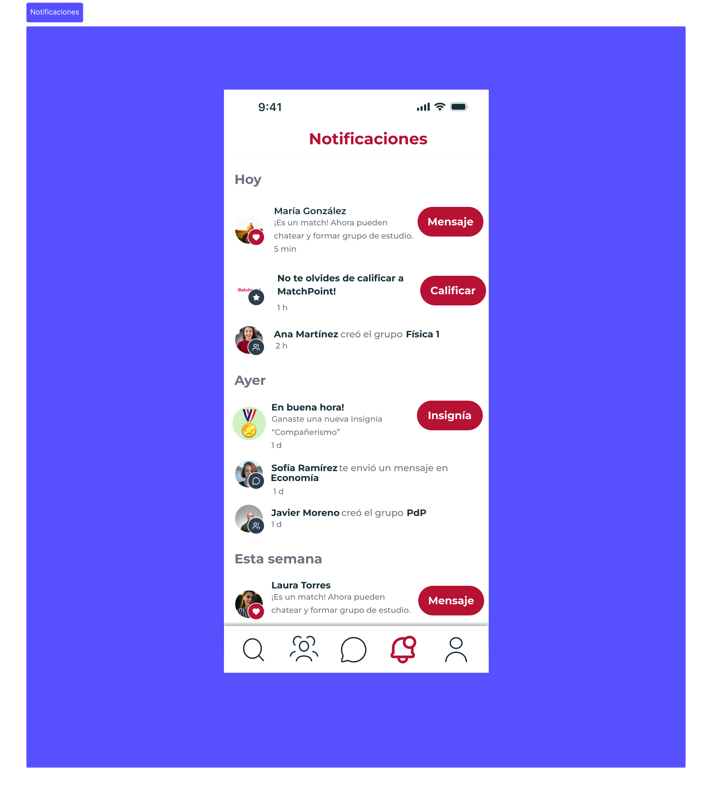
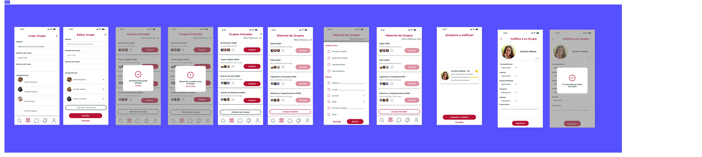
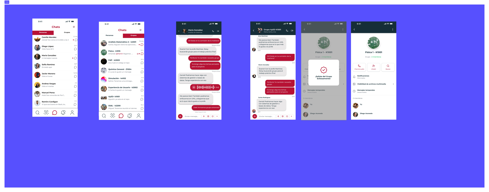
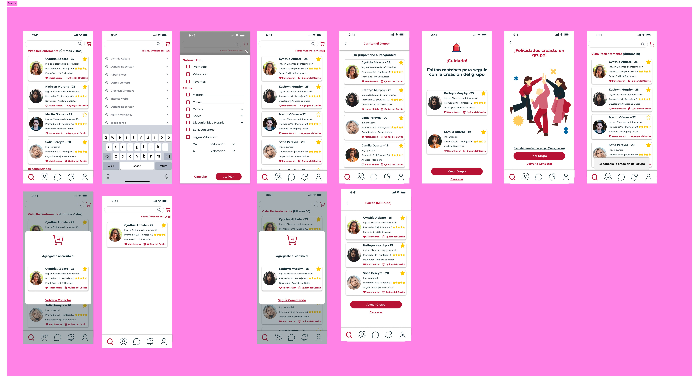
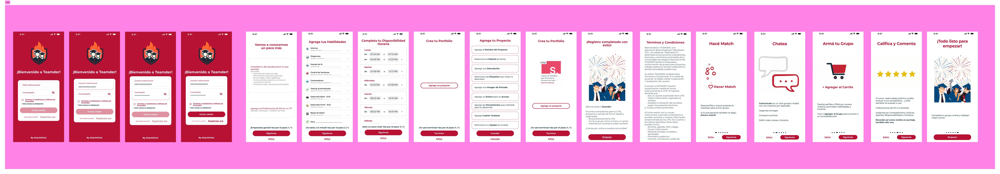

# Teamder (MatchPoint)

Diseño de producto UX/UI para una app que resuelve un problema puntual de la vida universitaria: encontrar compañeros para hacer trabajos prácticos, con una mecánica de "match" estilo Tinder.

Trabajo Práctico — Experiencia de Usuario, UTN FRBA (2026). Proyecto grupal, diseñado en Figma.

**[→ Ver prototipo interactivo en Figma](https://www.figma.com/proto/J7jPBHvojzGxZyfdHK2FqC/TP-TEAMDER?node-id=251-9791&page-id=1%3A571)**

## El problema

En la facultad es habitual quedar sin grupo para un TP, o armar uno a las apuradas sin saber si el resto va a cumplir. Teamder propone resolverlo con un mecanismo de descubrimiento y match: deslizás perfiles de compañeros filtrando por materia, carrera, sede y disponibilidad horaria, y cuando hay match mutuo se habilita el chat para armar el grupo.

## Mi rol en el proyecto

Diseñé el flujo de **notificaciones**, **chats** y **gestión de grupos**:

- **Notificaciones**: matches nuevos, mensajes, insignias ganadas y recordatorios de calificación, organizados por fecha (Hoy / Ayer / Esta semana).
- **Chats**: conversación individual y grupal, con historial de chats separado por personas y grupos.
- **Grupos**: alta y edición de un grupo de TP (materia, número de grupo, integrantes), historial de grupos con filtros, y el flujo de calificación entre compañeros al cerrar un TP (compañerismo, actitud, responsabilidad, iniciativa, aportes).

El resto del equipo diseñó el onboarding/login y el flujo de descubrimiento y match (swipe, carrito de candidatos, armado de grupo).

## Pantallas

### Notificaciones

### Grupos — creación, edición, historial y calificación

### Chats — individuales y grupales

### Descubrimiento y match (diseño del equipo)

### Onboarding y login (diseño del equipo)

## Herramientas

Figma (diseño de UI + prototipo interactivo).
